#  Drink-order-app 

## 📚  프로젝트 개요
이 프로젝트는 사용자가 간편하게 음료를 주문하고 관리할 수 있는 어플리케이션입니다. 원하는 음료를 선택하고 장바구니에 담아 손쉽게 주문할 수 있으며, 삭제 및 주문 내역 확인 기능을 제공합니다.

## 🎯 프로젝트 목표
이 프로젝트의 목표는 사용자가 편리하게 음료를 주문하고 관리할 수 있는 간편한 인터페이스를 제공하는 것뿐만 아니라, 누적 카운트를 통해 인기 있는 음료를 식별하고 베스트 메뉴로 표시하여 사용자에게 다양한 선택을 제공하는 것입니다.

## 📅 개발기간 
**프로젝트 시작일:** 2023년 12월 16일

**프로젝트 종료일:** 2024년 01월 18일

## 🌟 주요 기능
**🥤 음료 선택:** 메뉴에서 원하는 음료를 선택합니다.

**🛒 장바구니 담기:** 선택한 음료를 장바구니에 담아 빠르게 주문할 수 있습니다.

**📜 주문 내역 확인:** 선택한 음료를 장바구니에서 확인할 수 있습니다.

**🔄 수량 조절:** 장바구니에서 선택한 음료의 수량을 조절하여 주문을 더욱 세밀하게 조절할 수 있습니다.

**💰 합계 금액 표시:** 각 음료에 대한 수량 조절 시, 해당 음료의 합계 금액이 실시간으로 표시되어 주문한 음료의 총 금액을 확인할 수 있습니다. 

**🗑️ 삭제 기능:** 장바구니에 담은 음료를 필요에 따라 삭제할 수 있습니다.

**🚀 주문하기 및 장바구니 비우기:** 주문이 완료되면 주문한 음료의 총합계 금액이 표시되고, 주문하기 버튼을 누르면 주문이 완료되고 장바구니가 비워집니다. 

**🏆 누적 카운트:**  누적 카운트 및 베스트 아이콘을 추가하여 사용자들이 인기 음료를 쉽게 식별할 수 있도록 합니다.

## 📝 기능의 사용방법

### 1. 음료 선택 및 장바구니 담기

#### [음료 선택]
메뉴에서 원하는 음료를 선택합니다. 

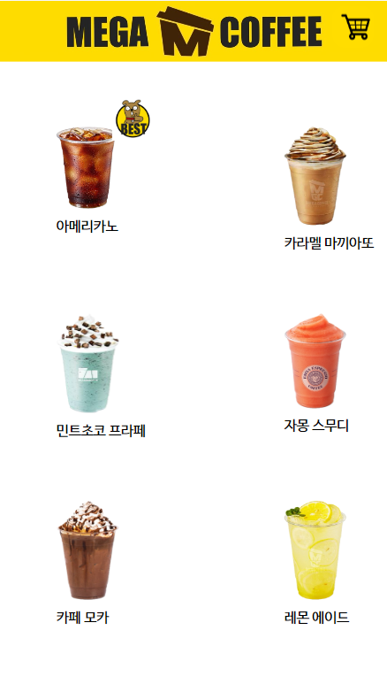

#### [상세 정보와 옵션 표시]
사용자가 음료를 선택하면 상세 정보와 함께 Hot 또는 Ice와 같은 옵션 선택이 화면에 나타납니다.

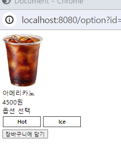

#### [옵션 선택 및 [장바구니에 담기]버튼 클릭]

원하는 옵션을 선택하고 [장바구니에 담기] 버튼을 클릭합니다. 

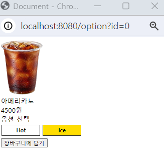

#### [알림창 표시 및 사용자 확인 후 추가]
- 사용자가 옵션을 선택한 후 [장바구니에 담기] 버튼을 클릭하면 확인을 위한 알림창이 화면에 나타납니다.

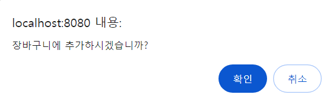

- 사용자가 '확인'을 선택하면 해당 음료와 선택한 옵션이 장바구니에 추가됩니다.

#### [옵션 선택하지 않고 담기 시 경고창]
옵션을 선택하지 않은 상태에서 [장바구니에 담기] 버튼을 클릭하면 사용자에게 옵션을 선택하라는 경고창이 나타납니다.

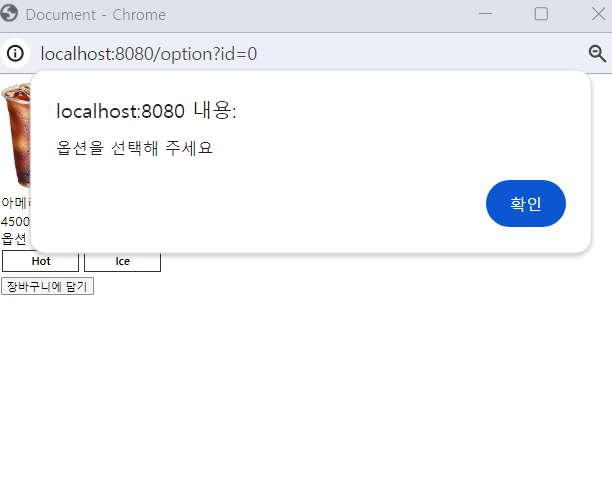

#### [Ice 옵션만 활성화] 
Ice만 가능한 음료를 선택했을 때는 Ice 옵션 버튼만 활성화되어 있습니다.

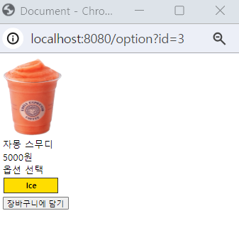

### 2. 주문 내역 확인

#### [주문 내역 화면]
주문 내역 확인을 선택하면 해당 주문에 대한 목록이 나타나고, 각 음료에 대한 수량과 선택한 옵션이 화면에 자세히 표시됩니다. 

#### [알림창 표시 및 자동 이동]
사용자가 [장바구니에 담기] 버튼을 클릭하면 알림창이 나타나며 '확인'을 선택하면 음료와 옵션이 자동으로 장바구니로 추가되고, 장바구니 화면으로 자동으로 이동합니다.

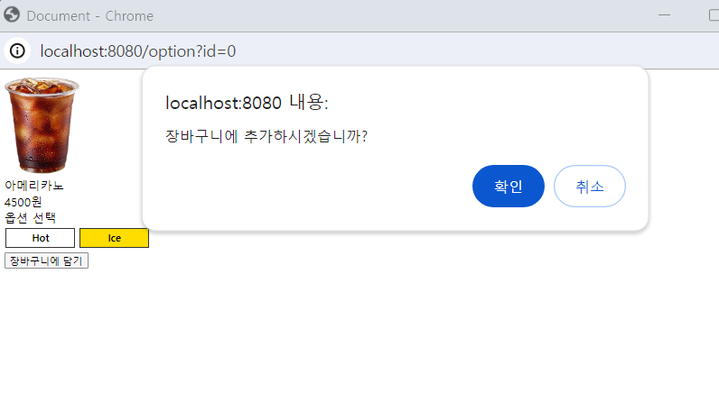
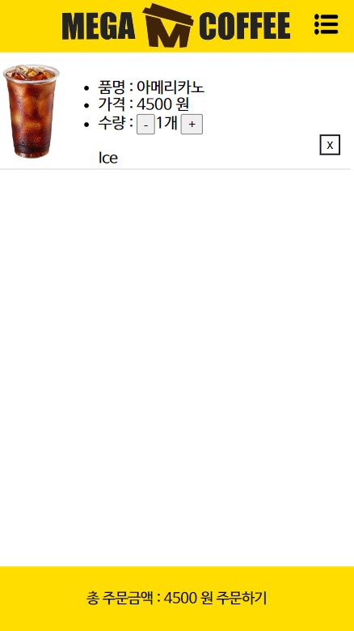

#### [수동으로 이동]
음료 선택 화면에서 오른쪽 상단에 위치한 카트 아이콘을 클릭하여 언제든지 수동으로 장바구니 화면으로 이동할 수 있습니다. 

### 3. 수량 조절

#### [수량 조절 기능]

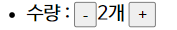

- **➖ 마이너스 버튼 :** 수량을 감소시키기 위해 마이너스 버튼을 누를 수 있습니다.

- **➕ 플러스 버튼 :** 수량을 증가시키기 위해 플러스 버튼을 누를 수 있습니다.

- **⚠️ 최소 주문 수량 제한 :** 1개 이하로 수량을 감소할 수 없으며, 최소 주문 수량이라는 알림창이 나타납니다.

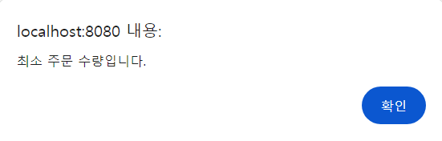

### 4. 합계 금액 표시

#### [주문 총합 표시]
장바구니에서는 선택한 음료의 총합계 금액이 표시됩니다. 이를 통해 사용자는 주문한 음료들의 금액을 한눈에 확인할 수 있습니다.

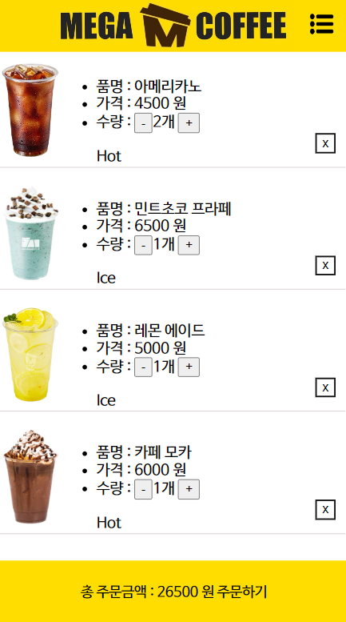

### 5. 삭제 기능 

#### [음료 삭제 버튼]
각 음료 상세정보 왼쪽 하단에는 ✖️ 표시가 있습니다.

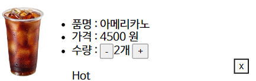

#### [알림창에서 삭제 확인]
✖️ 표시를 클릭하면 "삭제하시겠습니까?"라는 알림창이 나타나고 '확인'를 선택하면 해당 음료가 장바구니에서 삭제됩니다.

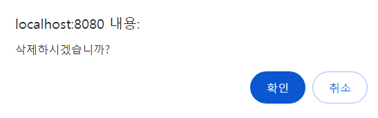

### 6. 주문하기 및 장바구니 비우기

#### [주문하기 버튼 클릭]
사용자가 장바구니 하단에 주문하기 버튼을 클릭하면 '주문하시겠습니까?'라는 알림창이 나오고 '확인'을 선택하면 주문 내역이 시스템에 전송됩니다.

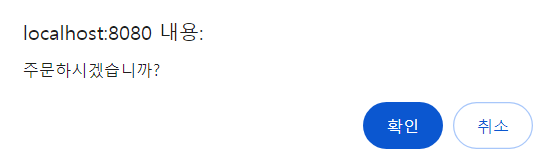

#### [장바구니 비우기]
주문이 완료되면 장바구니는 자동으로 비워지므로 사용자는 새로운 주문을 시작할 수 있습니다.

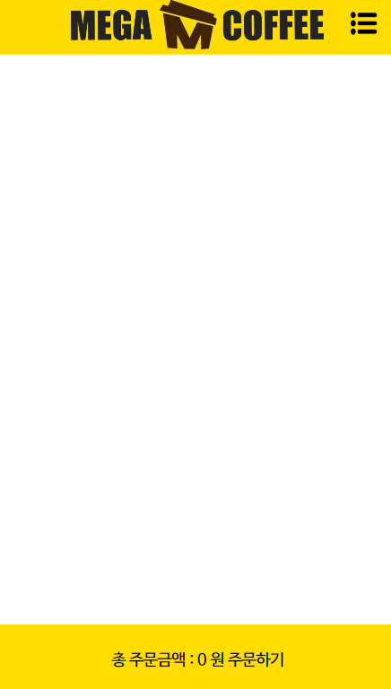

### 7. 누적 카운트

#### [누적 카운트 및 베스트 아이콘]
사용자가 해당 음료를 주문할 때마다 누적 카운트가 증가되며,
가장 누적 수가 많은 음료에는 베스트 아이콘이 자동으로 표시됩니다.

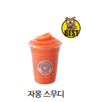

#### [아메리카노 기본 베스트 아이콘]
만약 모든 음료의 누적 카운트가 0인 경우, 아메리카노에는 기본으로 베스트 아이콘이 적용됩니다.

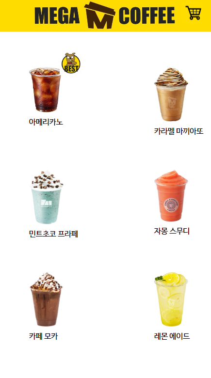